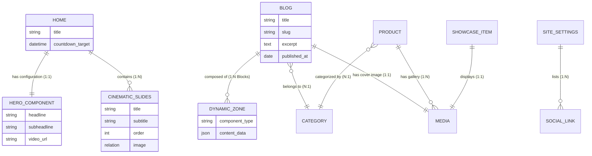

# Revolver Rift – CMS & API Architecture

## 1. System Architecture Flow

```mermaid
graph TD
    User[End User] -->|HTTPS| CDN[CDN / Edge Network]
    CDN -->|Load Balance| Client[React Frontend (Vite)]
    
    subgraph "Client Side"
        Client -->|REST API Calls| API[API Layer]
        Client -->|Asset Requests| MediaStorage[Media Storage (Cloudinary/S3)]
    end
    
    subgraph "Backend Infrastructure"
        API -->|Validates & Routes| Strapi[Strapi CMS v4]
        Strapi -->|Queries| DB[(PostgreSQL Database)]
        Strapi -->|Uploads| MediaStorage
    end

    classDef primary fill:#ff3333,stroke:#333,stroke-width:2px,color:white;
    classDef secondary fill:#000,stroke:#ff3333,stroke-width:2px,color:white;
    
    class Client,Strapi primary;
    class DB,MediaStorage secondary;
```

---

## 2. CMS Content Structure Tree

This structure defines the organization of content within the Strapi Admin Panel.

### **Single Types** (Static Pages)
*   **Home Page** (`/api/home`)
    *   *Controls the main landing page layout and hero content.*
*   **Site Settings** (`/api/site-settings`)
    *   *Global configuration like SEO defaults, social links, and logos.*

### **Collection Types** (Repeatable Content)
*   **Blogs** (`/api/blogs`)
    *   *Editorial content and news updates.*
*   **Products** (`/api/products`)
    *   *Merchandise and digital items for the shop.*
*   **Showcase Items** (`/api/showcase-items`)
    *   *Featured weapons, characters, or assets displayed in the gallery.*
*   **Partnership Tiers** (`/api/partnership-tiers`)
    *   *Sponsorship packages and tier details.*
*   **Categories**
    *   *Taxonomy for Blogs and Products.*

### **Components** (Reusable UI Blocks)
*   **Hero** (Group: `Layout`)
    *   *Main banner configuration.*
*   **Cinematic Slide** (Group: `Elements`)
    *   *Individual slide data for the homepage slider.*
*   **SEO Params** (Group: `Shared`)
    *   *Meta title, description, and social share image.*
*   **Social Link** (Group: `Shared`)
    *   *Platform name, URL, and Icon.*

### **Dynamic Zones** (Flexible Layouts)
*   **Content Sections** (Used in Blog, Pages)
    *   `Rich Text Block`
    *   `Image Grid`
    *   `Video Embed`
    *   `Quote Block`

---

## 3. Database Relationship Diagram



**Legend:**
*   **Rectangle**: Content Type / Entity
*   **Rounded**: Component / Data Structure
*   **Dashed**: Dynamic Zone Connection
*   **Cylinder**: Media / Database Asset

---

## 4. API Endpoint Structure

| Endpoint | Method | Purpose | Response Structure |
| :--- | :--- | :--- | :--- |
| `/api/home` | `GET` | Fetch homepage metadata, hero config, and cinematic slides. | `{ data: { attributes: { Hero: {...}, CinematicSlides: [...] } } }` |
| `/api/news` | `GET` | Fetch latest company news and announcements. | `{ data: [{ attributes: { title, summary, publishedAt... } }] }` |
| `/api/blogs` | `GET` | List all developer blog posts with pagination. | `{ data: [{ attributes: { title, slug, excerpt... } }], meta: {...} }` |
| `/api/blogs/:slug` | `GET` | Fetch single blog post detailed content (Dynamic Zone). | `{ data: { attributes: { Content: [ { __component: '...', ... } ] } } }` |
| `/api/products` | `GET` | List shop products. | `{ data: [{ attributes: { title, price, image... } }] }` |
| `/api/showcase-items` | `GET` | Fetch gallery/showcase assets (Weapons, Characters). | `{ data: [{ attributes: { name, type, media... } }] }` |
| `/api/partnership-tiers`| `GET` | List available partnership/sponsorship levels. | `{ data: [{ attributes: { name, price, benefits... } }] }` |
| `/api/site-settings` | `GET` | Global app configuration (Logos, Socials). | `{ data: { attributes: { siteName, socialLinks: [...] } } }` |

---

## 5. Implementation Phases

### **Phase 1: Content Modeling**
*   [ ] Initialize Strapi v4 project.
*   [ ] Create **Single Types** for `Home` and `Site Settings`.
*   [ ] Construct **Components** for `Hero`, `SEO`, and `Social Links`.
*   [ ] Configure **Media Library** settings (responsive formats).

### **Phase 2: Core Data Structure**
*   [ ] Build **Collection Types** for `Blogs`, `Products`, and `Showcase Items`.
*   [ ] Implement **Dynamic Zones** for rich content layouts in Blogs.
*   [ ] Set up relations between entities (e.g., Products <-> Categories).

### **Phase 3: Media & API Configuration**
*   [ ] Install Cloudinary/S3 provider for media storage.
*   [ ] Configure API Token permissions for public read access.
*   [ ] Populate initial mock data matches the structure of `shopData` and `galleryApi.js`.

### **Phase 4: Frontend Integration**
*   [ ] Create API service utilities in `src/api/` mirroring `strapi.js`.
*   [ ] Replace `shopData` import with `await getProducts()`.
*   [ ] Replace `galleryMedia` array with `await getShowcaseItems()`.
*   [ ] Implement `getHomeData()` to hydrate Hero and Cinematic Slider.

### **Phase 5: Production Deployment**
*   [ ] Deploy Strapi to hosting provider (e.g., Railway, Heroku, AWS).
*   [ ] Connect to production PostgreSQL database.
*   [ ] Verify Webhooks for frontend revalidation/rebuilds.
*   [ ] Final Security Audit (Roles & Permissions).
